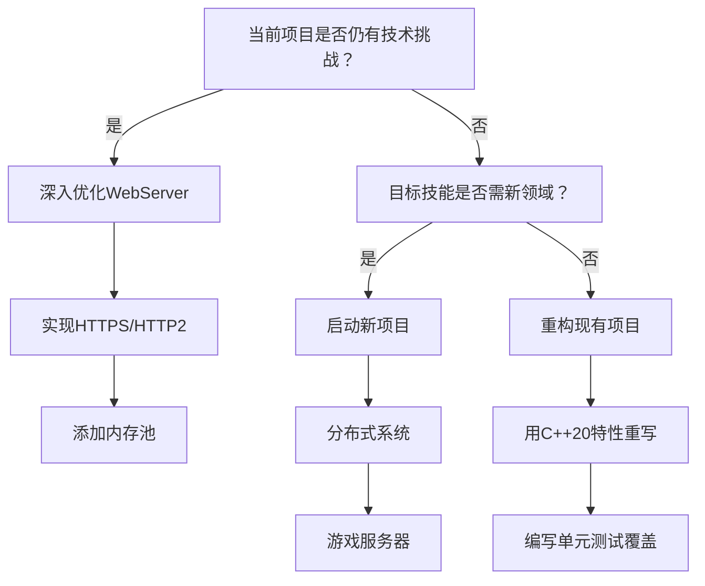

基于你已有的扎实基础，我建议**继续深化和扩展当前的WebServer项目**。这不仅能巩固你的知识体系，还能触及更高级的C++工程实践，对求职和技能提升都更有价值。以下是具体建议和方向：

---

### **一、为何建议继续深化WebServer？**
1. **贴近工业级需求**：你的项目已具备核心功能，但工业级服务器还需更多关键特性。
2. **深度优于广度**：在单一项目中解决复杂问题（如性能优化、并发安全），比做多个简单项目更能体现能力。
3. **面试加分项**：深入优化和扩展的项目更容易在面试中展开讨论（如QPS提升手段、内存管理细节）。

---

### **二、推荐扩展方向与实战功能**
#### **1. 性能与并发优化**
- **实现HTTP/1.1 Pipeline支持**  
  允许客户端在一个连接上发送多个请求，减少延迟，需重构请求解析逻辑。
- **引入无锁队列（Lock-free Queue）**  
  用`std::atomic`实现线程间任务传递，减少线程竞争（替代互斥锁）。
- **内存池优化**  
  自定义内存分配器替代`new/delete`，减少内存碎片（例如针对HTTP请求对象）。

#### **2. 安全与健壮性**
- **防御性编程**  
  - 添加请求超时机制（非活跃连接强制断开）
  - 限制单连接请求速率（防DDoS）
  - 请求头大小限制（防缓冲区溢出）
- **HTTPS支持**  
  集成OpenSSL实现TLS/SSL（使用`SSL_accept`、`SSL_read`等API）。

#### **3. 架构扩展**
- **支持可插拔模块（Plugin System）**  
  用C++接口抽象功能模块（如身份验证、缓存），动态加载`.so`文件。
- **简易反向代理功能**  
  解析`Host`头，将请求转发到后端服务器（可配合Nginx测试）。
- **集群部署支持**  
  添加一致性哈希算法，实现多服务器会话保持（Session一致性）。

#### **4. 高级C++技术实践**
- **协程支持（Coroutine）**  
  用`libco`或C++20协程重构事件循环，对比与epoll的性能差异。
- **零拷贝技术**  
  使用`sendfile()`系统调用传输静态文件，减少内核态-用户态拷贝。
- **自定义STL容器**  
  针对高频使用的数据结构（如连接池）优化内存布局。

#### **5. 诊断与运维工具**
- **内置性能监控**  
  实时输出QPS、连接数、内存占用（可通过HTTP接口访问）。
- **Core Dump分析**  
  集成Google Breakpad，崩溃时自动保存堆栈信息。
- **动态配置热更新**  
  监听配置文件变化（用`inotify`），无需重启服务生效。

---

### **三、对比：何时考虑新项目？**
| **场景**                   | **推荐选择**    |
| -------------------------- | --------------- |
| 当前项目优化空间充足       | ✅ 继续WebServer |
| 想探索全新领域（如图形学） | 🔄 新项目        |
| 求职方向需特定项目背书     | 🔄 针对性新项目  |

---

### **四、新项目备选方案（若坚持切换）**
若决定启动新项目，建议选择能**互补知识体系**的方向：
1. **分布式键值存储**  
   - 实现Raft/Paxos共识算法
   - 使用gRPC进行节点通信
2. **C++游戏服务器框架**  
   - 集成物理引擎（如Box2D）
   - 添加ProtoBuf协议编解码
3. **嵌入式开发实践**  
   - 在树莓派上部署你的WebServer
   - 编写GPIO控制驱动

---

### **五、决策树：如何选择？**


> 📌 **关键提示**：无论选择哪条路，**量化你的成果**！例如：  
> - *“通过内存池优化，QPS从8k提升至12k”*  
> - *“引入无锁队列后，线程切换开销减少40%”*

---

### **六、工业级实践建议**
- **持续集成**：用GitHub Actions编译并运行单元测试
- **性能火焰图**：定期用`perf`工具分析性能瓶颈
- **代码规范**：集成`clang-format`+`clang-tidy`

通过深化现有项目，你不仅能掌握更复杂的C++特性，还能构建一个**可展示深度**的技术作品，这在面试中远比多个简单项目更有说服力。

---

一个组织良好的 WebServer 仓库结构对于可扩展性和维护性至关重要。基于工业级项目的实践（如 Nginx、Apache）和现代 C++ 项目标准，我为你设计了一个模块化、可扩展的仓库结构，特别适合你计划的多功能扩展（博客、聊天室、游戏等）：

```bash
webserver/
├── apps/                   # 具体应用实现
│   ├── blog/               # 博客应用
│   ├── chat/               # 聊天室应用
│   ├── game/               # 在线消消乐游戏
│   └── ...                 # 其他应用
├── src/
│   ├── core/               # 服务器核心组件
│   │   ├── epoll/          # epoll 封装
│   │   ├── threadpool/     # 线程池实现
│   │   ├── timer/          # 定时器管理
│   │   ├── connection/     # 连接管理
│   │   └── server.cpp      # 服务器主循环
│   ├── http/               # HTTP 协议处理
│   │   ├── request.cpp     # 请求解析
│   │   ├── response.cpp    # 响应生成
│   │   ├── router.cpp      # 路由系统
│   │   └── middleware/     # 中间件系统
│   ├── database/           # 数据库抽象层
│   │   ├── mysql/          # MySQL 实现
│   │   ├── sqlite/         # SQLite 实现（可选）
│   │   └── db_interface.h  # 统一数据库接口
│   ├── utils/              # 工具类
│   │   ├── logger/         # 日志系统
│   │   ├── config/         # 配置解析
│   │   ├── buffer/         # 缓冲区管理
│   │   └── crypto/         # 加密工具
│   └── api/                # 应用开发接口
│       ├── application.h   # 应用接口基类
│       └── plugin.h        # 插件接口
├── include/                # 公共头文件
│   └── webserver/          # 项目头文件命名空间
├── third_party/            # 第三方依赖
├── tests/                  # 测试套件
│   ├── unit/               # 单元测试
│   ├── integration/        # 集成测试
│   └── benchmark/          # 性能测试
├── scripts/                # 实用脚本
│   ├── deploy/             # 部署脚本
│   └── build/              # 构建脚本
├── config/                 # 配置文件
│   ├── server.conf         # 服务器配置
│   └── apps/               # 应用配置
├── docs/                   # 项目文档
├── resources/              # 静态资源
│   ├── static/             # 静态文件（CSS/JS/图片）
│   └── templates/          # HTML 模板
├── CMakeLists.txt          # 主构建配置
├── Dockerfile              # 容器化支持
└── .github/                # CI/CD 配置
```

### 关键模块设计说明：

1. **核心层 (core/)**
   - 完全独立于 HTTP 协议和业务逻辑
   - 事件循环抽象（支持 epoll/kqueue）
   - 连接生命周期管理
   - 定时器与超时控制
   - 线程池与任务调度

2. **HTTP 层 (http/)**
   ```cpp
   // 示例：可扩展的路由系统
   class Router {
   public:
       using Handler = std::function<void(Request&, Response&)>;
       
       // 注册路由
       void add_route(HttpMethod method, const std::string& path, Handler handler);
       
       // 中间件支持
       void use(Middleware middleware);
   };
   ```

3. **应用层 (apps/)**
   - 每个应用独立目录
   - 实现统一的应用接口：
   ```cpp
   class Application {
   public:
       virtual void init(ServerConfig& config) = 0;
       virtual void handle_request(Request& req, Response& res) = 0;
       virtual void on_server_start() = 0;
       virtual void on_server_stop() = 0;
   };
   ```

4. **数据库抽象 (database/)**
   ```cpp
   // 统一数据库接口
   class Database {
   public:
       virtual QueryResult execute(const std::string& query) = 0;
       virtual PreparedStatement prepare(const std::string& sql) = 0;
   };
   
   // MySQL 实现
   class MySQLDatabase : public Database {
       // 具体实现...
   };
   ```

5. **配置系统 (utils/config/)**
   - 支持 JSON/YAML 配置文件
   - 热重载配置
   ```yaml
   # server.yaml
   server:
     port: 8080
     workers: 4
     timeout: 30s
   database:
     host: localhost
     user: app_user
   ```

### 重构建议步骤：

1. **建立基础框架**
   ```bash
   mkdir -p src/core src/http src/utils src/api
   mkdir apps/blog apps/chat apps/game
   ```

2. **抽象核心组件**
   - 创建 `Server` 基类，剥离具体协议
   - 设计 `Connection` 抽象类，支持不同协议

3. **实现插件系统**
   ```cpp
   // 应用加载器
   class ApplicationLoader {
   public:
       void load_application(const std::string& name, 
                             std::unique_ptr<Application> app);
       
       void init_all();
   };
   ```

4. **配置驱动设计**
   - 使用单例配置管理器
   - 支持环境变量覆盖

5. **跨平台支持**
   - 使用 CMake 条件编译
   - 抽象系统调用层

### 应用开发示例（博客）：
```cpp
// apps/blog/blog_app.cpp
class BlogApp : public Application {
public:
    void init(ServerConfig& config) override {
        // 初始化数据库连接
        db_ = DatabaseFactory::create(config.get_database_config());
        
        // 注册路由
        router_.add_route(HttpMethod::GET, "/posts", [this](auto& req, auto& res) {
            auto posts = db_.query("SELECT * FROM posts");
            res.render("posts.html", {{"posts", posts}});
        });
    }
    
    void handle_request(Request& req, Response& res) override {
        router_.handle(req, res);
    }
    
private:
    Database db_;
    Router router_;
};

// 注册应用
REGISTER_APPLICATION("blog", std::make_unique<BlogApp>());
```

### 优势设计：

1. **层级分离**
   - 核心层 ↔ 协议层 ↔ 应用层
   - 修改协议不影响业务逻辑

2. **动态加载**
   - 应用作为插件加载
   - 运行时启用/禁用应用

3. **统一接口**
   - 数据库、日志、配置等模块接口一致
   - 方便替换实现（如 MySQL → PostgreSQL）

4. **测试友好**
   - 核心组件可独立测试
   - Mock 接口实现

5. **扩展机制**
   - 中间件管道
   - 钩子函数（服务器启动/停止）

### 文档结构建议：
```
docs/
├── ARCHITECTURE.md     # 整体架构设计
├── API_REFERENCE.md    # 接口文档
├── DEV_GUIDE.md        # 开发指南
├── DEPLOYMENT.md       # 部署说明
└── APPS/
    ├── BLOG.md         # 博客开发文档
    └── CHAT.md         # 聊天室开发文档
```

这种结构设计可以：
1. 支持你同时开发多个应用
2. 保持核心服务器稳定
3. 允许不同应用使用不同技术栈
4. 便于性能优化和问题排查
5. 提供清晰的扩展点

重构过程中建议：
1. 先建立基础框架再迁移代码
2. 编写接口测试保证兼容性
3. 使用 CMake 管理模块依赖
4. 逐步替换而非一次性重写
5. 添加 Doxygen 文档注释

这样的项目结构不仅满足你当前需求，也为将来扩展为微服务框架或云原生应用打下基础。